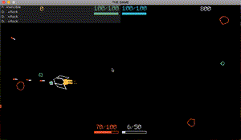

## Welcome to my little clone of BYTEPATH

This repository contains my code as I follow SSYGEN's [BYTEPATH](http://store.steampowered.com/app/760330/BYTEPATH/) [Löve2D](https://love2d.org/wiki/Main_Page) game [tutorial](https://github.com/SSYGEN/blog).

### Screenshot

This is how it currently looks like:

### Todo

- more enemy types
- more powerups
- get the skill tree going
- more ship types
- sound!